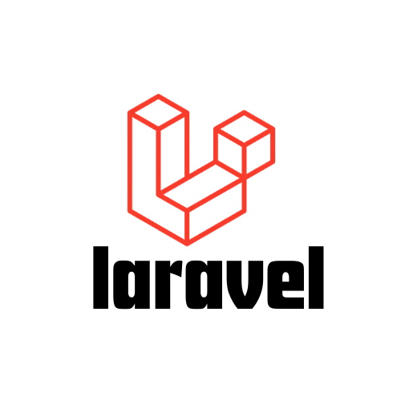

<div align="center">
  

# Production Laravel Docker Stack

Production-ready Docker setup for Laravel using PHP-Nginx

</div>

Production-ready Docker setup for Laravel using PHP-Nginx, with:

- Local development run
- MariaDB + phpMyAdmin stack
- Prebuilt-image deployment for staging/production
- GitHub Actions build/push workflow

## 1) File Roles (What each file is for)

- `Dockerfile` → Builds the Laravel app image (used locally and in CI)
- `docker-compose.yml` → Local app run on your machine
- `database/docker-compose.yml` → MariaDB + phpMyAdmin services
- `deployment/production/docker-compose.yml` → Live deployment using prebuilt image
- `deployment/staging/docker-compose.yml` → Staging deployment using prebuilt image
- `.github/workflows/deploy-to-prod.yml` → Build/push production image (deploy block optional)

## 2) Prerequisites

- Docker Engine / Docker Desktop with Compose v2
- Git
- Laravel app source code

## 3) Local Run (Quick Start)

1. Put your runtime env file at repository root as `.env`.
   - It is mounted to `/var/www/html/.env` in the container.
2. Start app:

```bash
docker compose up --build -d
```

3. Open app:
   - `http://localhost`

4. See logs:

```bash
docker compose logs -f app
```

5. Stop:

```bash
docker compose down
```

## 4) Use With Your Own Laravel App

This stack expects source code inside `application/`.

### Option A (Recommended)

Replace current `application/` with your Laravel project.

Checklist:

- Your project has `public/index.php`
- Root `.env` exists in this repository

Then rebuild:

```bash
docker compose up --build -d
```

### Option B (Different source folder)

If your app folder is not `application/`, edit this in `Dockerfile`:

```dockerfile
COPY application/ /var/www/html/
```

Change it to your folder path, then rebuild.

## 5) Database Stack (MariaDB + phpMyAdmin)

Create external network once:

```bash
docker network create db-network
```

Start DB services:

```bash
docker compose -f database/docker-compose.yml up -d
```

Open phpMyAdmin:

- `http://localhost:8090`

## 6) Production Deployment (Prebuilt Image)

Use `deployment/production/docker-compose.yml` for live deployment.

It is designed to:

- Pull prebuilt image from GHCR (`ghcr.io/...:production`)
- Mount host `storage` and host `.env`
- Run container without rebuilding on server

Typical production flow:

1. Build image from `Dockerfile`
2. Push image to GHCR
3. Deploy server stack using `deployment/production/docker-compose.yml`

## 7) GitHub Actions Flow

Workflow: `.github/workflows/deploy-to-prod.yml`

Current behavior:

- Trigger: push to `main` or manual run
- Builds image from `Dockerfile`
- Pushes tags:
  - `ghcr.io/<owner>/<project>:production`
  - `ghcr.io/<owner>/<project>:<commit-sha>`
- Creates automatic release tag
- Deploy job block exists but is currently commented out

If you want full auto-deploy, uncomment deploy job and configure required secrets.

## 8) Docker ENV Variables (App Runtime)

Current values in `Dockerfile`:

```dockerfile
ENV COMPOSER_ALLOW_SUPERUSER=1 \
    WEB_DOCUMENT_ROOT=/var/www/html/public \
    WEB_DOCUMENT_INDEX=index.php \
    SERVICE_NGINX_CLIENT_MAX_BODY_SIZE=200M \
    PHP_UPLOAD_MAX_FILESIZE=200M \
    PHP_POST_MAX_SIZE=200M \
    PHP_OPCACHE_MEMORY_CONSUMPTION=2048 \
    PHP_MEMORY_LIMIT=2G
```

What they mean:

- `COMPOSER_ALLOW_SUPERUSER=1` → Allows Composer as root during image build
- `WEB_DOCUMENT_ROOT=/var/www/html/public` → Laravel public web root
- `WEB_DOCUMENT_INDEX=index.php` → Default entry file
- `SERVICE_NGINX_CLIENT_MAX_BODY_SIZE` → Nginx request body size limit
- `PHP_UPLOAD_MAX_FILESIZE` → Max single upload size in PHP
- `PHP_POST_MAX_SIZE` → Max total POST body size
- `PHP_OPCACHE_MEMORY_CONSUMPTION` → OPcache memory size (MB)
- `PHP_MEMORY_LIMIT` → Per-request PHP memory limit

After changing these values, rebuild image:

```bash
docker compose up --build -d
```

## 9) Optional: PM2 for Laravel Worker Jobs

In `Dockerfile`, uncomment this block to install PM2:

```dockerfile
# RUN apt-get update \
#     && apt-get install -y --no-install-recommends nodejs npm \
#     && npm install -g pm2 \
#     && apt-get clean \
#     && rm -rf /var/lib/apt/lists/*
```

Rebuild:

```bash
docker compose up --build -d
```

Run queue worker with PM2:

```bash
pm2 start "php artisan queue:work --sleep=3 --tries=3 --timeout=120" --name laravel-queue
pm2 save
```

Useful commands:

```bash
pm2 list
pm2 logs laravel-queue
pm2 restart laravel-queue
pm2 delete laravel-queue
```

`entrypoint.sh` already contains a commented hook for auto-start script (`pm2_cronjobs/start-pm2-jobs.sh`) if you want PM2 jobs started on container boot.

## 10) Change PHP or MariaDB Version

### Change PHP image tag

Edit `Dockerfile`:

```dockerfile
FROM webdevops/php-nginx:8.2
```

Examples: `8.1`, `8.3`

Then rebuild:

```bash
docker compose up --build -d
```

### Change MariaDB image tag

Edit `database/docker-compose.yml`:

```yaml
image: mariadb:10
```

Examples: `10.11`, `11.4`

Apply:

```bash
docker compose -f database/docker-compose.yml pull
docker compose -f database/docker-compose.yml up -d
```

## 11) Common Commands

Artisan:

```bash
docker compose exec app php artisan
```

Migrate:

```bash
docker compose exec app php artisan migrate
```

Install composer packages:

```bash
docker compose exec app composer install
```

## 12) Notes

- Container startup prepares storage/cache permissions and runs cache warmup commands.
- This image uses PHP 8.x; verify framework/package compatibility before version upgrades.
- For production scale, queue workers are often better in a separate worker container.
